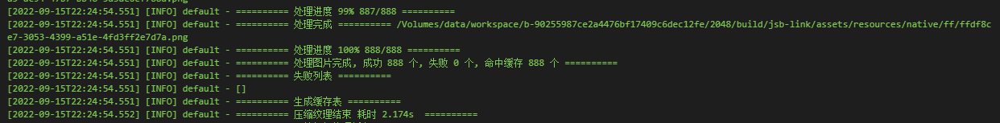
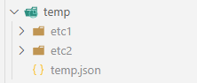

# cocos-compress_etc

基于 Node.js 的 Cocos Creator 压缩纹理构建工具

## 快速使用

1. 将项目 `script` 目录复制至 cocos creator 项目下
2. 安装日志模块依赖 `npm install log4js`
3. 运行 cocos creator 构建，构建 Android、iOS 端产物，项目中无需配置图片压缩纹理
4. 运行压缩纹理命令

```sh
// ETC1 格式压缩纹理 - 兼容 Android 低端机型

node ./script compress_etc.js etc1

// ETC2 格式压缩纹理 - 适用于 iOS 机型

node ./script compress_etc.js etc2
```

脚本会扫描构建产物中所有图片资源，在执行压缩纹理后替换对应资源，如图:



脚本会在 `script/temp` 目录下保存对应格式的纹理缓存，在下次构建时使用，提升构建速度，如图:




## 主要优势

构建速度更快

1. 多核并行处理：Cocos Creator 自身的压缩纹理构建是单核串行构建，无法充分利用多核 CPU 性能，此脚本充分利用 CPU 性能提升构建速度
2. MD5 缓存：Cocos Creator 自身是通过比对文件修改时间来判断是否命中纹理缓存，再多人开发或切换分支时容易导致缓存失效，此脚本通过 MD5 比对的方式判断缓存是否命中，缓存命中率更高

## 注意事项

在 MacOS 系统下会存在透明度精度丢失问题，可参照 https://forum.cocos.org/t/ios-etc-mac/88456 与 https://community.arm.com/support-forums/f/graphics-gaming-and-vr-forum/6595/the-alpha-value-is-not-correct-after-compression-by-tct-mac-v4-2 通过 imagemagick 替换解决